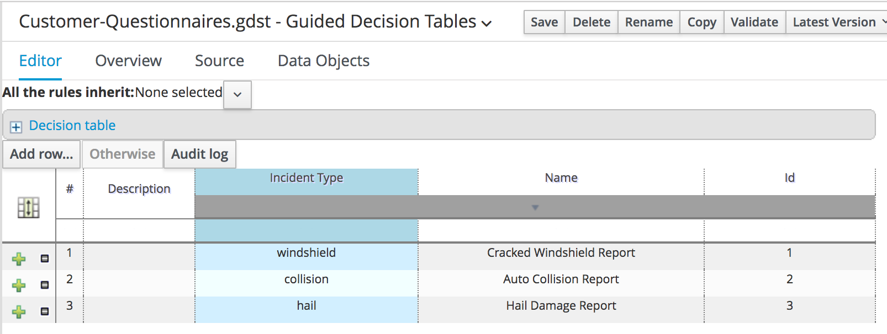

# Red Hat BRMS Decision Service Example

This BRMS KJAR project defines a decision service that constructs and updates dynamic questionnaires that can be utilized in web or mobile client applications.

## Running

The rules depend on the domain project, so that must project must be built and accessible via Maven to the runtime environment.

The "util" project includes a postman collection (summit17-demo.postman_collection.json) that demonstrates calling the rest endpoints for this when deployed to a Intelligent Decision Server instance, specifically:

* Decisions - Get Qeuestionnaire
* Decisions - Update Questions

These postman examples require 
