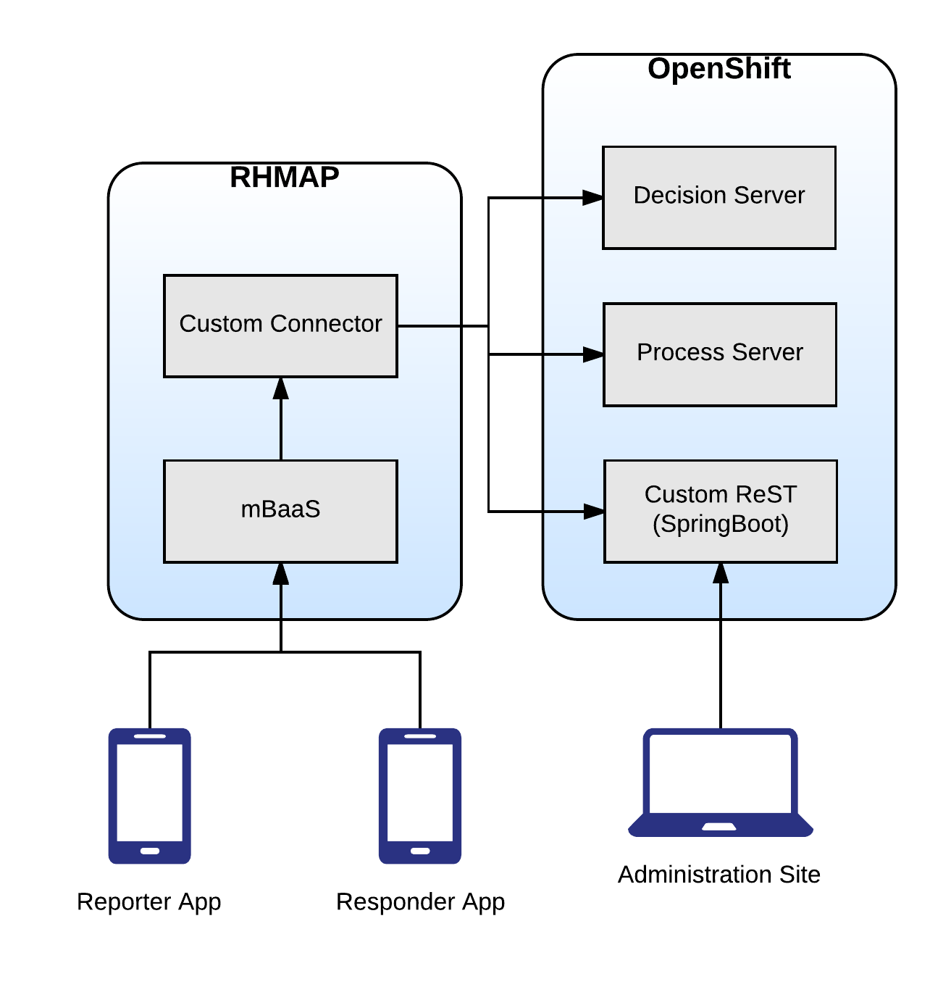

# Example of Mobile + BPM/BRMS Microservices

This set of applications demonstrates putting together a series of micro-services, that include Business Rules and Processes that are consumed in mobile applications.  These components can be built and deployed in number of ways, and we will be providing instructions on deploying to Red Hat OpenShift Container Platform.

## General Architecture

## Folder structure

* decisions
  * kjar project powering dynamic questionnaire
* domain
  * common domain objects used for both decisions and processes
* openshift
  * source2image (s2i) definitions used
  * information on configuring in an OCP environment
* processes
  * kjar project defining incident response workflow
* services
  * SpringBoot application that serves as a photo repository for the workflow
* util
  * postman collection to test the micro-services
  * unit tests to generate Intelligent Process/Decision server commands

## Instructions for running locally

Coming soon!

## Instructions for running in OpenShift online

Coming soong!
